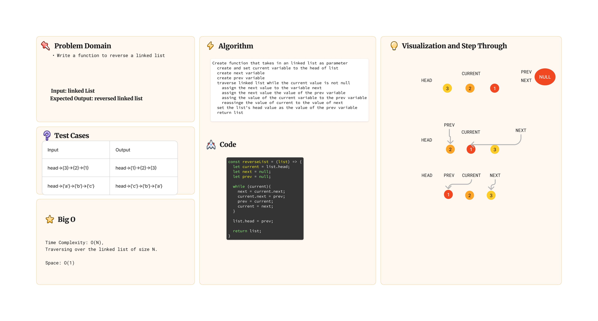
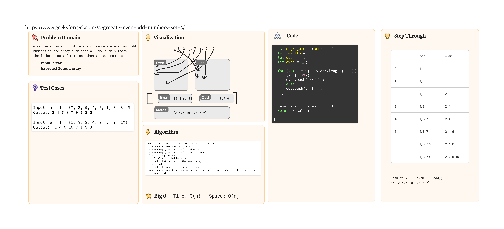

# Challenge Title: Alternate Code Challenges in Preparation for White Board Final

## Description

### Challenge 36

Problem Domain: Create a function that takes in a linked list and reverses it.

### Challenge 37 [URL](https://www.geeksforgeeks.org/segregate-even-odd-numbers-set-3/)

Given an array arr[] of integers, segregate even and odd numbers in the array such that all the even numbers should be present first, and then the odd numbers.

## Resources

Lecture Notes (Ryan Gallaway's 401d53 Class)
[Geeks for Geeks](https://www.geeksforgeeks.org)

## Tests

### Run tests in terminal

no tests presently available

- `cd` into `javascript/whitboard-code-challenges/stack-queue`
- run `npm test alt.test.js`

## Whiteboard

## Solution

[Link to Code](./index.js)
