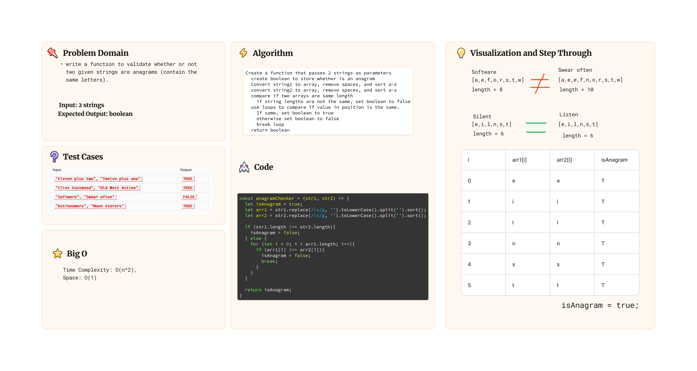

# Code Challenge 40

## Description

Write a function to validate whether or not two given strings are anagrams (contain the same letters).

## Tests

### Run tests in terminal

- `cd` into `javascript/whitboard-code-challenges/stack-queue`
- run `npm test anagram.test.js`

## Whiteboard

## Solution

[Link to Code](./index.js)
