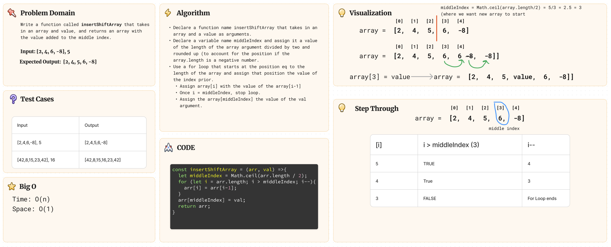

# Challenge Title: Array Reverse

## Whiteboard Process



## Approach & Efficiency

I solve the challenge by utilizing array.length and a for loop that iterates through an array starting at the array.length and stopping at the midpoint.

## Solution

``` js
const insertShiftArray = (arr, val) =>{
  let middleIndex = Math.ceil(arr.length / 2);

  for (let i = arr.length; i > middleIndex; i--){
    arr[i] = arr[i-1];
  }
  
  arr[middleIndex] = val;

  return arr;
}


//Example

console.log(insertShiftArray([2,4,6,-8], 5)); // outputs: [ 2, 4, 5, 6, -8 ]
console.log(insertShiftArray([42,8,15,23,42], 16)); //outputs [ 42, 8, 15, 16, 23, 42 ]
```
