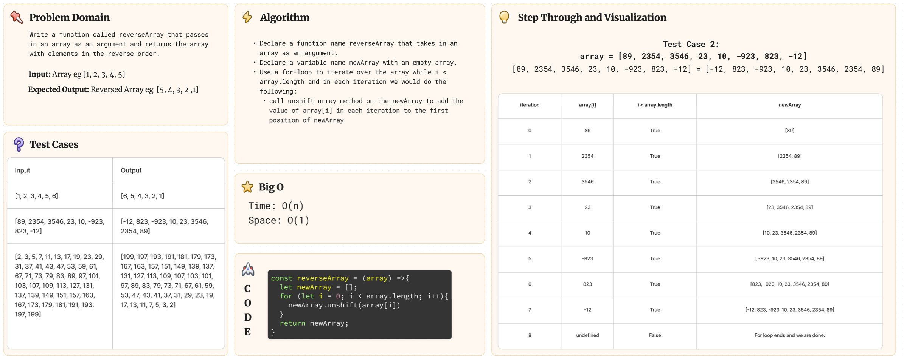

# Challenge Title: Array Reverse

## Whiteboard Process



## Approach & Efficiency

I wanted to take a different approach to the assignment and solve the challenge by taking an array of values, and returning a new array with the values in reverse order.

## Solution

``` js
const reverseArray = (array) =>{
  let newArray = [];
  for (let i = 0; i < array.length; i++){
    newArray.unshift(array[i])
  }
  return newArray;
}

//Example

let testArray = [5, 2, 6, 8, 1]

console.log(reverseArray(testArray)); //returns [1, 8, 6, 2, 5]
```
