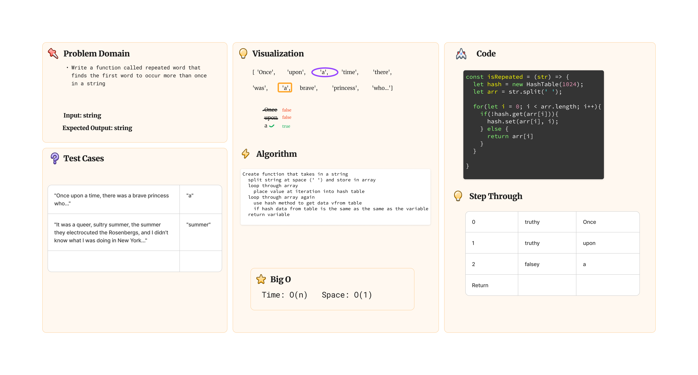

# Challenge Title: Hash Table Implementation

## Description

### Challenge 30

Implement a Hashtable Class with the following methods:

- `set`
  - Arguments: key, value
  - Returns: nothing
  - This method should hash the key, and set the key and value pair in the table, handling collisions as needed.
  Should a given key already exist, replace its value from the value argument given to this method.
- `get`
  - Arguments: key
  - Returns: Value associated with that key in the table
- `has`
  - Arguments: key
  - Returns: Boolean, indicating if the key exists in the table already.
- `keys`
  - Returns: Collection of keys
- `hash`
  - Arguments: key
  - Returns: Index in the collection for that key

## Resources

Lecture Notes (Ryan Gallaway's 401d53 Class)

## Tests

### Challenge 30 Tests

- Setting a key/value to your hashtable results in the value being in the data structure
- Retrieving based on a key returns the value stored
- Successfully returns null for a key that does not exist in the hashtable
- Successfully returns a list of all unique keys that exist in the hashtable
- Successfully handle a collision within the hashtable
- Successfully retrieve a value from a bucket within the hashtable that has a collision
- Successfully hash a key to an in-range value

### Run tests in terminal

- `cd` into `javascript/whitboard-code-challenges/hashtable`
- run `npm test whiteboard-code-challenges/hashtable/index.test.js`

## Solution

[Hash Table Code](./index.js)

## Whiteboard

