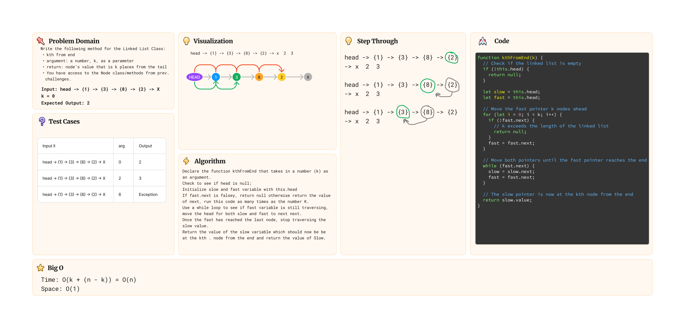

# Challenge Title: Linked List kthFromEnd

## Whiteboard



## Approach & Efficiency

Linked List implementation build based on class class lecture.

## Pair Programming

Whiteboard Pair Programming with [Ryan Eastman](https://github.com/DocHolliday13x)

## Tests

``` js
describe('Testing Linked List - kthFromEnd() Method', () => {
  test('Where k is greater than the length of the linked list', () => {
    const list = new LinkedList();
    list.append(1);
    list.append(2);
    list.append(3);

    expect(list.kthFromEnd(4)).toBeNull();
  });

  test('Where K and the Length of the List are the Same', () => {
    const list = new LinkedList();
    list.append(1);
    list.append(2);
    list.append(3);

    expect(list.kthFromEnd(3)).toBeNull;
  });

  test('Where k and the length of the list are the same', () => {
    const list = new LinkedList();
    list.append(1);
    list.append(2);
    list.append(3);

    expect(list.kthFromEnd(2)).toBe(1);
  });

  test('Where k is not a positive integer', () => {
    const list = new LinkedList();
    list.append(1);
    list.append(2);
    list.append(3);

    expect(list.kthFromEnd(-1)).toBeNull();
  });

  test('Where the linked list is of size 1', () => {
    const list = new LinkedList();
    list.append(1);

    expect(list.kthFromEnd(0)).toBe(1);
  });

  test('“Happy Path” where k is not at the end, but somewhere in the middle of the linked list', () => {
    const list = new LinkedList();
    list.append(1);
    list.append(2);
    list.append(3);
    list.append(4);
    list.append(5);

    expect(list.kthFromEnd(2)).toBe(3);
  });

});
```

## Solution

``` js

  kthFromEnd(k){
    if (!this.head) return null;
    if (k < 0) return null;

    let runner = this.head;
    let current = this.head;

    for (let i = 0; i < k; i++){
      if(i < k){
        if(!runner.next) return null;
        runner = runner.next;
      }
    }

    while(runner.next){
      runner = runner.next;
      current = current.next;
    }

    return current.value;
  }

```
