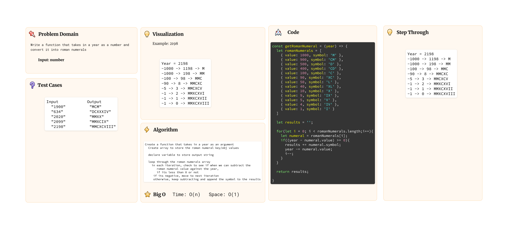

# Code Challenge 33

## Description

   Write a function that takes in a year as a number and converts it into its Roman Numeral representation.

## Whiteboard Process



## Tests

```cli
 PASS  whiteboard-code-challenges/romanNumerals/roman-num.test.js
  Testing roman numerals
    ✓ 2020 should return MMXX (2 ms)
    ✓ 634 should equal DCXXXIV

----------|---------|----------|---------|---------|-------------------
File      | % Stmts | % Branch | % Funcs | % Lines | Uncovered Line #s
----------|---------|----------|---------|---------|-------------------
All files |     100 |      100 |     100 |     100 |
 index.js |     100 |      100 |     100 |     100 |
----------|---------|----------|---------|---------|-------------------
Test Suites: 1 passed, 1 total
Tests:       2 passed, 2 total
Snapshots:   0 total
Time:        0.333 s, estimated 1 s
```


## Solution

[Solution Code Found here](./index.js)
