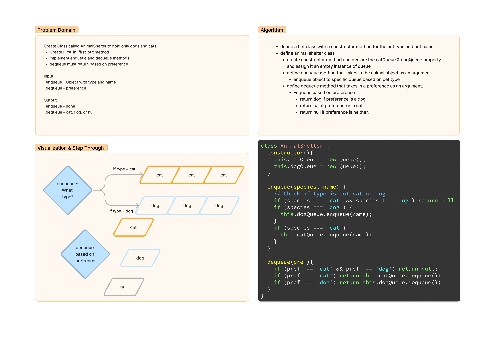

# Challenge Title: Stacks and Queues Implementation

## Description

### Challenge 10

- Create a Node class that has properties for the value stored in the Node, and a pointer to the next node.
- Create a Stack class that has a top property. It creates an empty Stack when instantiated.
- Create a Queue class that has a front property. It creates an empty Queue when instantiated.

### Challenge 11

- Implement a queue using two stacks
- Create a new class called PseudoQueue
- implement the standard queue interface
  - enqueue that passes in a value
  - dequeue that extracts a value

### Challenge 12

- Create a class called AnimalShelter which holds only dogs and cats.
- Implement the following methods:
  - Enqueue
    - `animal` can be either a dog or a cat object.
    - It must have a `species` property that is either "`cat`" or "`dog`"
    - It must have a `name` property that is a string.
  - Dequeue
    -Arguments: pref
    - pref can be either "dog" or "cat"
    - Return: either a dog or a cat, based on preference.
      - If pref is not "dog" or "cat" then return null.

## Whiteboard Process

## Approach & Efficiency
<!-- What approach did you take? Why? What is the Big O space/time for this approach? -->

## Tests

### Run tests in terminal

- `cd` into `javascript/whitboard-code-challenges/stack-queue`
- run `npm test stack-queue.test.js`

### Challenge 10 Tests

- Can successfully push onto a stack
- Can successfully push multiple values onto a stack
- Can successfully pop off the stack
- Can successfully empty a stack after multiple pops
- Can successfully peek the next item on the stack
- Can successfully instantiate an empty stack
- Calling pop or peek on empty stack raises exception
- Can successfully enqueue into a queue
- Can successfully enqueue multiple values into a queue
- Can successfully dequeue out of a queue the expected value
- Can successfully peek into a queue, seeing the expected value
- Can successfully empty a queue after multiple dequeues
- Can successfully instantiate an empty queue
- Calling dequeue or peek on empty queue raises exception

### Challenge 11 Tests

- Can successfully enqueue into a queue
- Can successfully enqueue multiple values into a queue
- Can successfully dequeue out of a queue the expected value
- Can successfully empty a queue after multiple dequeues
- Can successfully instantiate an empty queue
- Calling dequeue on empty queue raises exception

### Challenge 12 Tests

- Can successfully enqueue dog into the dog queue
- Can successfully enqueue cat into the cat queue
- Calling enqueue on any other species raises exception (1 ms)
- Can successfully dequeue dog into the dog queue
- Can successfully dequeue cat into the cat queue
- Calling dequeue on any other preference raises exception

## Solution

[Stacks and Queue Code](./index.js)
