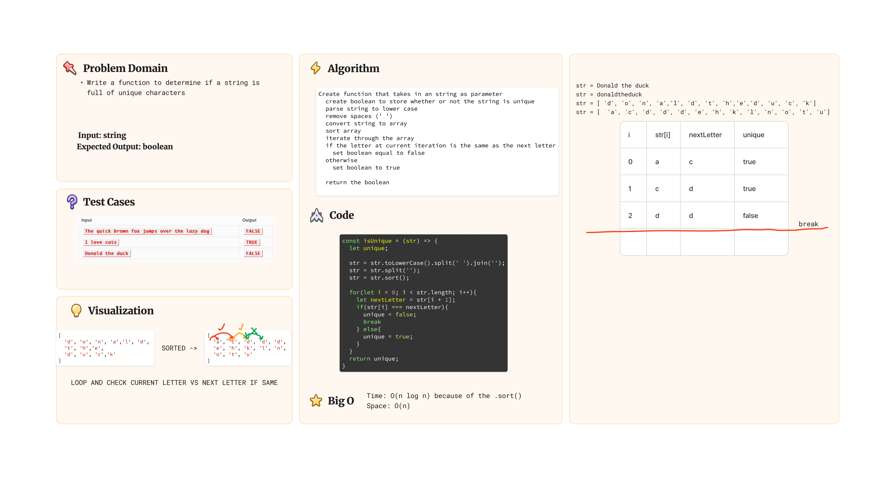

# Challenge Title: Array Reverse

## Whiteboard Process



## Approach & Efficiency

Used array and built-in array funtions to solve the problem.

## Solution
[Link to solution](./index.js)

``` js
const isUnique = (str) => {
  let unique;

  str = str.toLowerCase().split(' ').join('');
  str = str.split('');
  str = str.sort();

  for(let i = 0; i < str.length; i++){
    let nextLetter = str[i + 1];
    if(str[i] === nextLetter){
      unique = false;
      break;
    } else{
      unique = true;
    }
  }
  return unique;
};
```
