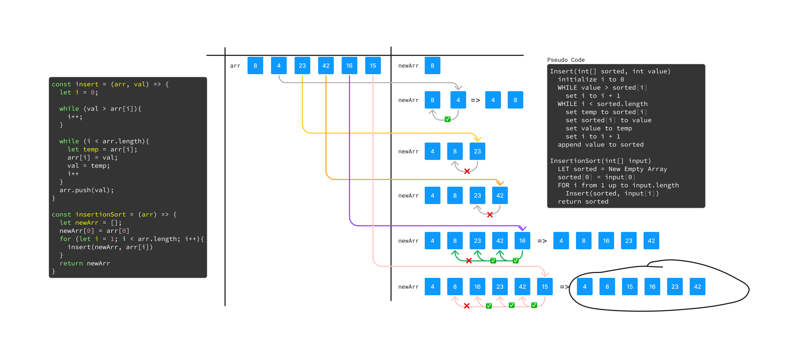

# Insertion Sort

Insertion Sort is a sorting algorithm that creates a new sorted array one item at a time. It iterates through the array, taking each element and comparing it to the the item on the left and places the value in the correct sorted position.

## PseudoCode

  ``` markdown
    Insert(int[] sorted, int value)
      initialize i to 0
      WHILE value > sorted[i]
        set i to i + 1
      WHILE i < sorted.length
        set temp to sorted[i]
        set sorted[i] to value
        set value to temp
        set i to i + 1
      append value to sorted

    InsertionSort(int[] input)
      LET sorted = New Empty Array
      sorted[0] = input[0]
      FOR i from 1 up to input.length
        Insert(sorted, input[i])
      return sorted
  ```

## Working Code

  ``` javascript
      const insert = (arr, val) => {
      let i = 0;

      while (val > arr[i]){
        i++;
      }

      while (i < arr.length){
        let temp = arr[i];
        arr[i] = val;
        val = temp;
        i++;
      }
      arr.push(val);
    };

    const insertionSort = (arr) => {
      let newArr = [];
      newArr[0] = arr[0];
      for (let i = 1; i < arr.length; i++){
        insert(newArr, arr[i]);
      }
      return newArr;
    };


    let arrayToSort = [ 8, 4, 23, 42, 16, 15];
    let reverseSorted = [20,18,12,8,5,-2];
    let fewUniques = [5,12,7,5,5,7];
    let nearlySorted = [2,3,5,7,13,11];

    console.log('base sort >>>',insertionSort(arrayToSort));
    console.log('reverse sorted >>>',insertionSort(reverseSorted));
    console.log('few unique sorted >>> ',insertionSort(fewUniques));
    console.log('nearly sorted >>> ',insertionSort(nearlySorted));
  ```

### Visual

  

### Trace

__SAMPLE ARRAY__: [ 8, 4, 23, 42, 16, 15]

1. In the first iteration, the first element is considered sorted so we move on to the next element, 4. Since 4 is smaller than 8, we will move 4 to the correct position.

    > newArr = [ 4, 8 ]

1. In the second iteration, we pass the value of 23. We then compare it to the values in the sorted array `newArr` and ensure it is in the correct position.

    > newArr = [ 4, 8, 23 ]

1. In the third iteration, we pass the value of 42. We then compare it to the values in the sorted array `newArr` and ensure it is in the correct position.

    > newArr = [ 4, 8, 23, 42 ]

1. In the fourth iteration, we pass the value of 16. We then compare it to the values in the sorted array `newArr` and ensure it is in the correct position.

    > newArr = [ 4, 8, 16, 23, 42 ]

1. In the final iteration, we pass the value of 15. We then compare it to the values in the sorted array `newArr` and ensure it is in the correct position.

    > newArr = [ 4, 8, 15, 16, 23, 42 ]

### Efficiency

#### Time: O(n^2)

  > The basic operation of this algorithm is comparison. This will happen n * (n-1) number of times…concluding the algorithm to be n squared.

#### Space: O(1)

  > No additional space is being created. This array is being sorted in place…keeping the space at constant O(1).
