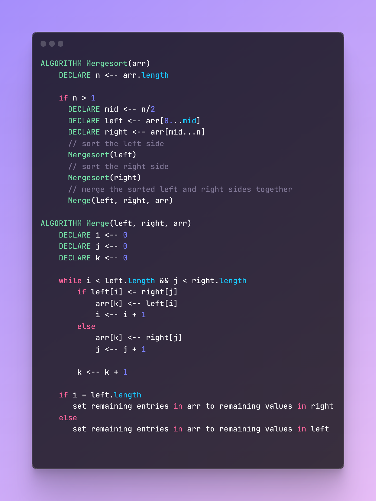
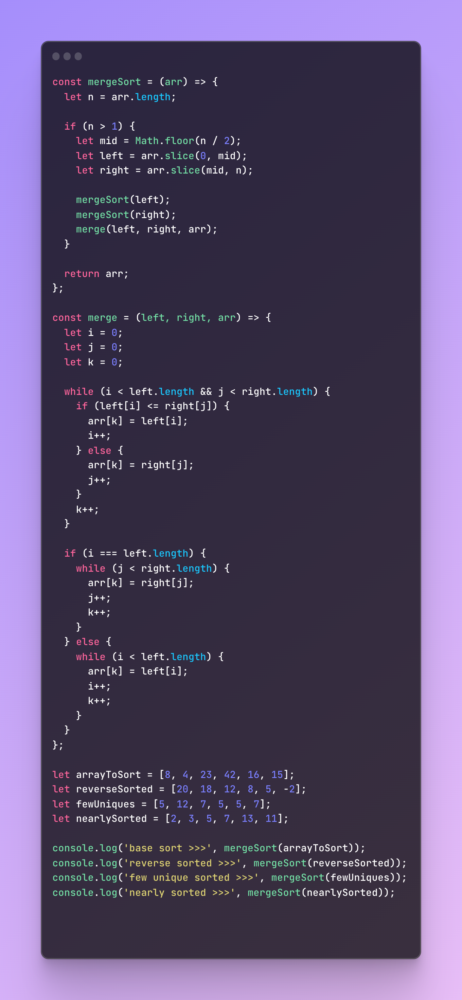
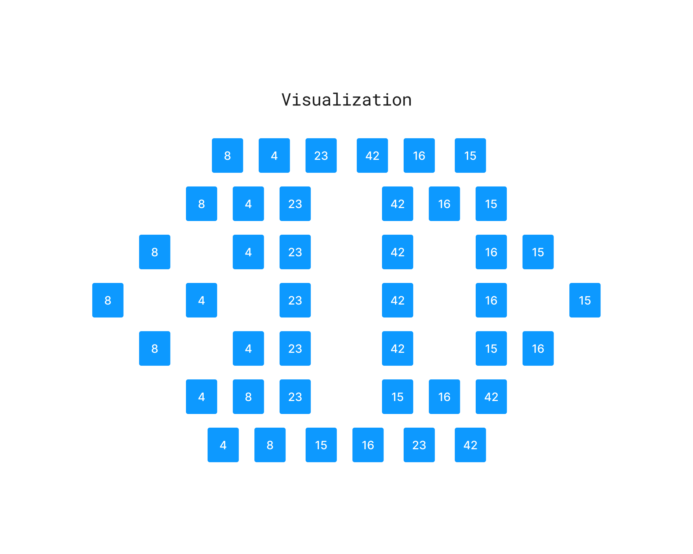

# Merge Sort

Insertion Sort is a sorting algorithm that splits an array in half, sorts the two smaller arrays recursively, and then merges them back together to create a larger sorted array.

## PseudoCode

## Working Code

### Visual

  

### Trace

__SAMPLE ARRAY__: [ 8, 4, 23, 42, 16, 15]

1. The algorithm starts by dividing the input array in half, creating smaller arrays until each array only contains one element

    > [ 8, 4, 23, 42, 16, 15]
    > [ 8, 4, 23], [42, 16, 15]
    > [8], [4, 23], [ 42], [ 16, 15]
    > [8], [4], [23], [42], [16], [15]

1. Once the length of each smaller array is 1, we start merging the array back together, comparing and sorting the values in each step of the way until were back at a merged array that is sorted completely `[4, 8, 15, 16, 23, 42]`

### Efficiency

#### Time: O(n log n)

  > The merge() function will have a time of O(n). The mergeSort() function has a time of O(log n). Combined will give the Big O a time of O (n log n)

#### Space: O(n)
